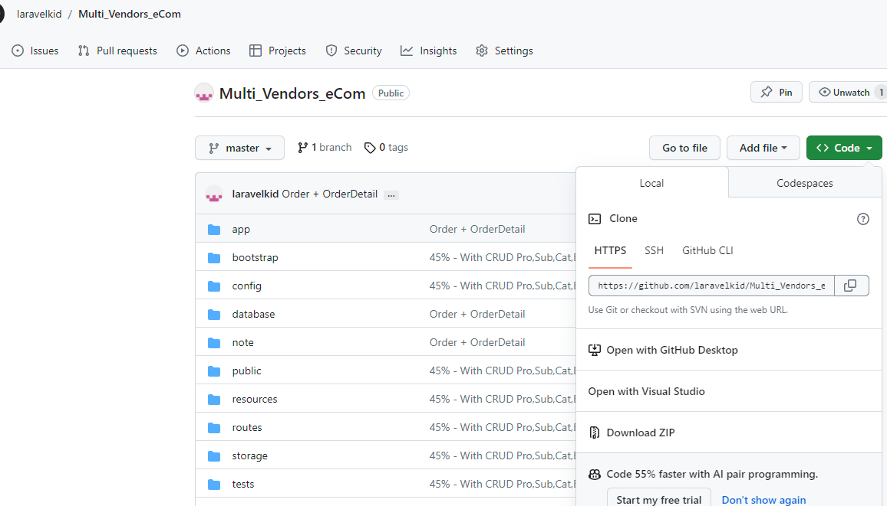

<!-- ? Quản Lý Sàn Thương Mại Điện Tử  -->

Vào Thư Mục Note Để Xem Tài Liệu

Nên Clone trong SourceTree để xem cho rõ

B1: Clone Project về , tạo file .env (Trong Note có config.txt , lấy nội dung trong đó rồi paste vào .env)

B2: Vào .env sửa thành tên database mình, vào xampp tạo database , nhớ chỉnh bảng mã thành utf8mb4_unicode_ci

B3: Mở Terminal chạy lần lượt lệnh 

+ composer update
  
+ php artisan migrate
  
+ php artisan migrate:refresh
  
+ php artisan db:seed --class=CategoriesSeeder
  
  php artisan db:seed --class=SubCategoriesSeeder
  
  php artisan db:seed --class=BrandsSeeder

  php artisan db:seed --class=UsersTableSeeder
  
  php artisan db:seed --class=ProductsSeeder
  

  
+ npm install
  
B4: Chạy tiếp lệnh php artisan serve để run trang web

B5: Vào admin/dashboard để xem

// Chưa làm Create User,Gian Hàng
